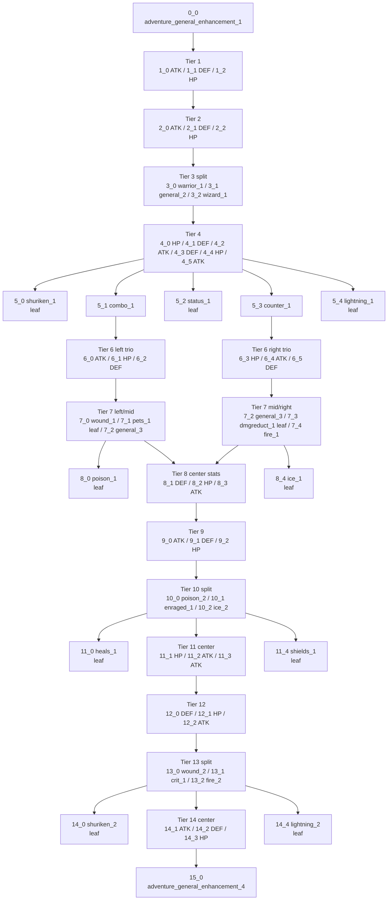

# Skill Trees System -- Datamine Reference

> **Sources:** `SkillTrees_CDN.json`, `skilltree_node_list.txt`, `skilltree_nodes.txt`, plus a check of `firebase_config_extracted.json` for supporting/localized skill-node data.
>
> **Important data caveat:** the captured runtime log repeatedly reports `No LocalSkillTreeNodeData ... skipping` for these skill nodes, and the supplied Firebase dump does not expose matching resolved node-text/value payloads for the listed `localDataId`s. Because of that, this document preserves the exact `localDataId` strings and only humanizes them where the ID itself is self-descriptive. Exact numeric effect magnitudes are **not** present in the supplied capture.

---

## 1. Overview & Global Settings

The captured skill system contains **two separate trees**:

- **Adventure Tree** (`adventure`)
- **Specialization Tree** (`specialization`)

Both trees are research-based progression systems with **time-gated unlocks**, **one concurrent research per tree**, optional **time reductions**, and **gem-based instant completion**.

### 1.1.1 What Counts as "Books"

The captured data does **not** expose a friendlier display label such as "books" or "tomes" for tree research currency. The exact currency IDs in the files are:

- `adventure_tree_currency`
- `specialization_tree_currency`

If you are referring to the skill-tree research books, these two currency IDs are the exact book-cost currencies used by every node in the captured config.

### 1.1 Core Tree Settings

| Parameter | Adventure | Specialization | Notes |
|---|---:|---:|---|
| Tree ID | `adventure` | `specialization` | Exact JSON keys |
| Unlock Chapter | 5 | 11 | `unlockChapter` |
| Prerequisite Mode | `Unlocked` | `Unlocked` | Exact `parentPrerequisiteMode` value |
| Max Concurrent Unlocks | 1 | 1 | One active research per tree |
| Currency ID | `adventure_tree_currency` | `specialization_tree_currency` | Native research currency |
| Time Reduction Ratio | `0.1` | `0.1` | Exact `timeReductionRatio` |
| Time Reduction Minimum | 5 minutes | 5 minutes | Exact `timeReductionMin` |
| Max Time Reductions | 4 | 4 | Exact `maxTimeReductions` |
| Time Reduction Price | `RV x1` | `RV x1` | Exact `timeReductionPriceDatas` |
| Instant Unlock Price | 15 gems/minute | 10 gems/minute | Exact `instantUnlockPriceDatasPerMinute` |
| Research Complete Title | `Skill Research Complete!` | `Skill Research Complete!` | Same in both trees |
| Research Complete Body | `Login to start a new research!` | `Login to start a new research!` | Same in both trees |

### 1.2 Aggregate Completion Totals

These totals assume **maxing every node to its listed `maxLevel`**.

| Tree | Nodes | Total Research Actions | Full Book Cost (Tree Currency) | Full Research Time | Instant-Finish Gem Equivalent |
|---|---:|---:|---:|---:|---:|
| Adventure | 60 | 414 | 4,228,325 `adventure_tree_currency` | 285,556 minutes | 4,283,340 gems |
| Specialization | 88 | 880 | 4,680,600 `specialization_tree_currency` | 363,540 minutes | 3,635,400 gems |
| Combined System | 148 | 1,294 | `4,228,325 ATC + 4,680,600 STC` | 649,096 raw minutes across both trees | 7,918,740 gems |

### 1.3 Wall-Clock Implications

- Because `maxConcurrentUnlocks` is stored **per tree**, the data proves you can only run **one Adventure research** and **one Specialization research** at a time.
- The data does **not** show a single cross-tree shared queue.
- That means:
  - **Adventure-only full clear** is **285,556 minutes** (`198d 7h 16m`).
  - **Specialization-only full clear** is **363,540 minutes** (`252d 11h 0m`).
  - If both trees can run in parallel once both are unlocked, post-Chapter-11 wall-clock is dominated by the slower tree: **363,540 minutes**.
  - If a player were somehow forced to do both serially, the raw sum is **649,096 minutes** (`450d 18h 16m`).

### 1.4 Attached Exact Per-Node Schedule

The full node-by-node level schedule is attached in `SKILLTREES_NODE_LEVEL_COSTS.csv`.

That attachment is pulled directly from `SkillTrees_CDN.json` and includes, for **every single node**:

- exact node ID
- exact `localDataId`
- max level
- exact tree currency used for that node's book cost
- exact `costByLevel` array
- exact `minutesByLevel` array
- exact node total cost
- exact node total time
- exact child-node links

The arrays are pipe-delimited in the CSV so you can read each level cost/time in-order from level 1 onward without any derived interpolation.

---

## 2. Shared Research Mechanics

### 2.1 Queue Limit

Both trees set:

- `maxConcurrentUnlocks: 1`

That is a strict one-at-a-time research queue **within each tree**.

### 2.2 Prerequisite Mode

Both trees set:

- `parentPrerequisiteMode: "Unlocked"`

What is exact from the files:

- Child availability is governed by **parent links** encoded through `childNodeIds`.
- The prerequisite mode string is **`Unlocked`**, not `Maxed` or another value.
- Nodes with multiple incoming edges clearly exist in both trees.

What the supplied files do **not** explicitly spell out:

- Whether a multi-parent node requires **all listed parents** or **any one listed parent**.
- Whether the `0.1` time reduction ratio applies to **base time** or **remaining time**.

Because of that, the node tables below list **every exact incoming parent link** and **every exact outgoing child link**, without over-claiming the engine-side logic beyond the literal config values.

### 2.3 Time-Lock / Skip System

Both trees share the same time-reduction framework:

- `timeReductionRatio: 0.1`
- `timeReductionMin: 5`
- `maxTimeReductions: 4`
- `timeReductionPriceDatas: [{ type: "RV", amount: 1 }]`

That means each node research can be shortened up to **4 times**, using **1 RV per reduction**. The config exposes the ratio and floor, but not the exact runtime formula text.

### 2.4 Instant Finish

Instant completion is priced linearly per minute:

- Adventure: `15 gems` per minute
- Specialization: `10 gems` per minute

### 2.5 Currency Model

All node unlock prices in both trees are encoded as **single-currency arrays**:

- Adventure nodes always consume `adventure_tree_currency`
- Specialization nodes always consume `specialization_tree_currency`

No node in the supplied dataset uses mixed currencies or item costs for its standard level unlock price.

---

## 3. Adventure Tree

The Adventure Tree unlocks at **Chapter 5** and is a **single 16-tier structure** with heavy use of forks, convergences, and optional leaf nodes. It contains:

- **60 nodes**
- **414 total research actions**
- **4,228,325 `adventure_tree_currency`** to fully max
- **285,556 minutes** of raw research time to fully max

Structurally, the tree alternates between:

- generic stat trios (`small_atk_buff`, `small_def_buff`, `small_hp_buff`)
- one-rank gate nodes (`general`, `warrior`, `wizard`)
- themed enhancement side branches (`shuriken`, `status`, `counter`, `wound`, `fire`, `ice`, etc.)
- several clear **leaf nodes** that do not feed deeper progression

### 3.1 High-Level Adventure Layout

### 3.2 Adventure Structure Notes

- **Leaf side branches** with no children are:
  - `5_0`, `5_2`, `5_4`
  - `7_1`, `7_3`
  - `8_0`, `8_4`
  - `11_0`, `11_4`
  - `14_0`, `14_4`
  - final capstone `15_0`
- The deepest central path repeatedly converges through:
  - `3_1`
  - `5_1` / `5_3`
  - `7_2`
  - `10_1`
  - `13_1`
  - `15_0`
- The capstone `15_0` is reached from the final center trio:
  - `14_1`, `14_2`, `14_3`

### 3.3 Adventure Research Ladders

All Adventure costs are in `adventure_tree_currency`.

| Ladder | Max Lvl | Costs by Level | Node Total Cost | Minutes by Level | Node Total Minutes |
|---|---:|---|---:|---|---:|
| `A0` | 1 | `[100]` | 100 | `[1]` | 1 |
| `A1` | 10 | `[150, 175, 200, 250, 300, 350, 425, 525, 625, 750]` | 3,750 | `[5, 10, 15, 20, 30, 45, 50, 60, 75, 90]` | 400 |
| `A2` | 10 | `[250, 300, 350, 425, 500, 600, 725, 875, 1000, 1200]` | 6,225 | `[15, 20, 30, 45, 50, 60, 75, 90, 105, 120]` | 610 |
| `A3` | 1 | `[400]` | 400 | `[45]` | 45 |
| `A4` | 10 | `[650, 775, 925, 1100, 1300, 1600, 1900, 2300, 2700, 3300]` | 16,550 | `[75, 90, 105, 120, 150, 210, 240, 300, 360, 480]` | 2,130 |
| `A5a` | 4 | `[1000, 1200, 1400, 1700]` | 5,300 | `[120, 150, 180, 210]` | 660 |
| `A5b` | 2 | `[1000, 1200]` | 2,200 | `[120, 150]` | 270 |
| `A6` | 10 | `[1500, 1800, 2100, 2500, 3100, 3700, 4400, 5300, 6400, 7700]` | 38,500 | `[180, 210, 240, 300, 360, 480, 600, 720, 960, 1200]` | 5,250 |
| `A7a` | 4 | `[2200, 2600, 3100, 3800]` | 11,700 | `[240, 300, 360, 480]` | 1,380 |
| `A7b` | 2 | `[2200, 2600]` | 4,800 | `[240, 300]` | 540 |
| `A7c` | 1 | `[2200]` | 2,200 | `[240]` | 240 |
| `A8a` | 4 | `[3200, 3800, 4600, 5500]` | 17,100 | `[360, 480, 600, 720]` | 2,160 |
| `A8b` | 10 | `[3200, 3800, 4600, 5500, 6600, 7900, 9500, 11000, 13500, 16500]` | 82,100 | `[360, 480, 600, 720, 960, 1080, 1200, 1440, 1440, 1440]` | 9,720 |
| `A9` | 10 | `[4500, 5400, 6400, 7700, 9300, 11000, 13000, 16000, 19000, 23000]` | 115,300 | `[480, 600, 720, 960, 1080, 1200, 1440, 1440, 1440, 1440]` | 10,800 |
| `A10a` | 4 | `[6000, 7200, 8600, 10000]` | 31,800 | `[600, 720, 960, 1080]` | 3,360 |
| `A10b` | 3 | `[6000, 7200, 8600]` | 21,800 | `[600, 720, 960]` | 2,280 |
| `A11a` | 4 | `[8000, 9600, 11500, 13500]` | 42,600 | `[720, 960, 1080, 1200]` | 3,960 |
| `A11b` | 10 | `[8000, 9600, 11500, 13500, 16500, 19500, 23500, 28500, 34000, 41000]` | 205,600 | `[720, 960, 1080, 1200, 1440, 1440, 1440, 1440, 1440, 1440]` | 12,600 |
| `A12` | 10 | `[10000, 12000, 14000, 17000, 20500, 24500, 29500, 35500, 42500, 51500]` | 257,000 | `[960, 1080, 1440, 1440, 1440, 1440, 1440, 1440, 1440, 1440]` | 13,560 |
| `A13a` | 4 | `[13000, 15500, 18500, 22000]` | 69,000 | `[1080, 1200, 1440, 1440]` | 5,160 |
| `A13b` | 3 | `[13000, 15500, 18500]` | 47,000 | `[1080, 1200, 1440]` | 3,720 |
| `A14a` | 4 | `[16000, 19000, 23000, 27500]` | 85,500 | `[1200, 1440, 1440, 1440]` | 5,520 |
| `A14b` | 10 | `[16000, 19000, 23000, 27500, 33000, 39500, 47500, 57000, 68500, 82500]` | 413,500 | `[1200, 1440, 1440, 1440, 1440, 1440, 1440, 1440, 1440, 1440]` | 14,160 |
| `A15` | 1 | `[20000]` | 20,000 | `[1440]` | 1,440 |

### 3.4 Adventure Nodes, Tiers 0-4

**Effect/theme note:** because local node text is missing, the “Effect / theme” column is an exact-ID-grounded label, not a localized in-game string.

| Node | `localDataId` | Effect / Theme | Max | Parents | Children | Ladder |
|---|---|---|---:|---|---|---|
| `0_0` | `adventure_general_enhancement_1` | General enhancement I | 1 | `--` | `1_0, 1_1, 1_2` | `A0` |
| `1_0` | `small_atk_buff` | Small ATK buff | 10 | `0_0` | `2_0` | `A1` |
| `1_1` | `small_def_buff` | Small DEF buff | 10 | `0_0` | `2_1` | `A1` |
| `1_2` | `small_hp_buff` | Small HP buff | 10 | `0_0` | `2_2` | `A1` |
| `2_0` | `small_atk_buff` | Small ATK buff | 10 | `1_0` | `3_0, 3_1` | `A2` |
| `2_1` | `small_def_buff` | Small DEF buff | 10 | `1_1` | `3_1` | `A2` |
| `2_2` | `small_hp_buff` | Small HP buff | 10 | `1_2` | `3_1, 3_2` | `A2` |
| `3_0` | `adventure_warrior_enhancement_1` | Warrior-tagged enhancement I | 1 | `2_0` | `4_0, 4_1, 4_2` | `A3` |
| `3_1` | `adventure_general_enhancement_2` | General enhancement II | 1 | `2_0, 2_1, 2_2` | `4_2, 4_3` | `A3` |
| `3_2` | `adventure_wizard_enhancement_1` | Wizard-tagged enhancement I | 1 | `2_2` | `4_3, 4_4, 4_5` | `A3` |
| `4_0` | `small_hp_buff` | Small HP buff | 10 | `3_0` | `5_0, 5_1` | `A4` |
| `4_1` | `small_def_buff` | Small DEF buff | 10 | `3_0` | `5_1` | `A4` |
| `4_2` | `small_atk_buff` | Small ATK buff | 10 | `3_0, 3_1` | `5_1, 5_2` | `A4` |
| `4_3` | `small_def_buff` | Small DEF buff | 10 | `3_1, 3_2` | `5_2, 5_3` | `A4` |
| `4_4` | `small_hp_buff` | Small HP buff | 10 | `3_2` | `5_3` | `A4` |
| `4_5` | `small_atk_buff` | Small ATK buff | 10 | `3_2` | `5_3, 5_4` | `A4` |

### 3.5 Adventure Nodes, Tiers 5-10

| Node | `localDataId` | Effect / Theme | Max | Parents | Children | Ladder |
|---|---|---|---:|---|---|---|
| `5_0` | `adventure_shuriken_enhancement_1` | Shuriken enhancement I | 4 | `4_0` | `--` | `A5a` |
| `5_1` | `adventure_combo_enhancement_1` | Combo enhancement I | 4 | `4_0, 4_1, 4_2` | `6_0, 6_1, 6_2` | `A5a` |
| `5_2` | `adventure_status_enhancement_1` | Status enhancement I | 2 | `4_2, 4_3` | `--` | `A5b` |
| `5_3` | `adventure_counter_enhancement_1` | Counter enhancement I | 4 | `4_3, 4_4, 4_5` | `6_3, 6_4, 6_5` | `A5a` |
| `5_4` | `adventure_lightning_enhancement_1` | Lightning enhancement I | 4 | `4_5` | `--` | `A5a` |
| `6_0` | `small_atk_buff` | Small ATK buff | 10 | `5_1` | `7_0, 7_1` | `A6` |
| `6_1` | `small_hp_buff` | Small HP buff | 10 | `5_1` | `7_1` | `A6` |
| `6_2` | `small_def_buff` | Small DEF buff | 10 | `5_1` | `7_1, 7_2` | `A6` |
| `6_3` | `small_hp_buff` | Small HP buff | 10 | `5_3` | `7_2, 7_3` | `A6` |
| `6_4` | `small_atk_buff` | Small ATK buff | 10 | `5_3` | `7_3` | `A6` |
| `6_5` | `small_def_buff` | Small DEF buff | 10 | `5_3` | `7_3, 7_4` | `A6` |
| `7_0` | `adventure_wound_enhancement_1` | Wound enhancement I | 4 | `6_0` | `8_0` | `A7a` |
| `7_1` | `adventure_pets_enhancement_1` | Pets enhancement I | 2 | `6_0, 6_1, 6_2` | `--` | `A7b` |
| `7_2` | `adventure_general_enhancement_3` | General enhancement III | 1 | `6_2, 6_3` | `8_1, 8_2, 8_3` | `A7c` |
| `7_3` | `adventure_dmgreduct_enhancement_1` | Damage-reduction enhancement I | 4 | `6_3, 6_4, 6_5` | `--` | `A7a` |
| `7_4` | `adventure_fire_enhancement_1` | Fire enhancement I | 4 | `6_5` | `8_4` | `A7a` |
| `8_0` | `adventure_poison_enhancement_1` | Poison enhancement I | 4 | `7_0` | `--` | `A8a` |
| `8_1` | `small_def_buff` | Small DEF buff | 10 | `7_2` | `9_0` | `A8b` |
| `8_2` | `small_hp_buff` | Small HP buff | 10 | `7_2` | `9_1` | `A8b` |
| `8_3` | `small_atk_buff` | Small ATK buff | 10 | `7_2` | `9_2` | `A8b` |
| `8_4` | `adventure_ice_enhancement_1` | Ice enhancement I | 4 | `7_4` | `--` | `A8a` |
| `9_0` | `small_atk_buff` | Small ATK buff | 10 | `8_1` | `10_0, 10_1` | `A9` |
| `9_1` | `small_def_buff` | Small DEF buff | 10 | `8_2` | `10_1` | `A9` |
| `9_2` | `small_hp_buff` | Small HP buff | 10 | `8_3` | `10_1, 10_2` | `A9` |
| `10_0` | `adventure_poison_enhancement_2` | Poison enhancement II | 3 | `9_0` | `11_0, 11_1` | `A10b` |
| `10_1` | `adventure_enraged_enhancement_1` | Enraged enhancement I | 4 | `9_0, 9_1, 9_2` | `11_1, 11_2, 11_3` | `A10a` |
| `10_2` | `adventure_ice_enhancement_2` | Ice enhancement II | 4 | `9_2` | `11_3, 11_4` | `A10a` |

### 3.6 Adventure Nodes, Tiers 11-15

| Node | `localDataId` | Effect / Theme | Max | Parents | Children | Ladder |
|---|---|---|---:|---|---|---|
| `11_0` | `adventure_heals_enhancement_1` | Heals enhancement I | 4 | `10_0` | `--` | `A11a` |
| `11_1` | `small_hp_buff` | Small HP buff | 10 | `10_0, 10_1` | `12_0` | `A11b` |
| `11_2` | `small_atk_buff` | Small ATK buff | 10 | `10_1` | `12_1` | `A11b` |
| `11_3` | `small_atk_buff` | Small ATK buff | 10 | `10_1, 10_2` | `12_2` | `A11b` |
| `11_4` | `adventure_shields_enhancement_1` | Shields enhancement I | 4 | `10_2` | `--` | `A11a` |
| `12_0` | `small_def_buff` | Small DEF buff | 10 | `11_1` | `13_0, 13_1` | `A12` |
| `12_1` | `small_hp_buff` | Small HP buff | 10 | `11_2` | `13_1` | `A12` |
| `12_2` | `small_atk_buff` | Small ATK buff | 10 | `11_3` | `13_1, 13_2` | `A12` |
| `13_0` | `adventure_wound_enhancement_2` | Wound enhancement II | 4 | `12_0` | `14_0, 14_1` | `A13a` |
| `13_1` | `adventure_crit_enhancement_1` | Crit enhancement I | 3 | `12_0, 12_1, 12_2` | `14_1, 14_2, 14_3` | `A13b` |
| `13_2` | `adventure_fire_enhancement_2` | Fire enhancement II | 4 | `12_2` | `14_3, 14_4` | `A13a` |
| `14_0` | `adventure_shuriken_enhancement_2` | Shuriken enhancement II | 4 | `13_0` | `--` | `A14a` |
| `14_1` | `small_atk_buff` | Small ATK buff | 10 | `13_0, 13_1` | `15_0` | `A14b` |
| `14_2` | `small_def_buff` | Small DEF buff | 10 | `13_1` | `15_0` | `A14b` |
| `14_3` | `small_hp_buff` | Small HP buff | 10 | `13_1, 13_2` | `15_0` | `A14b` |
| `14_4` | `adventure_lightning_enhancement_2` | Lightning enhancement II | 4 | `13_2` | `--` | `A14a` |
| `15_0` | `adventure_general_enhancement_4` | General enhancement IV | 1 | `14_1, 14_2, 14_3` | `--` | `A15` |

---

## 4. Specialization Tree

The Specialization Tree unlocks at **Chapter 11** and is structurally different from Adventure:

- it is one tree with **four independent root branches**
- all four branches share the **same economic ladder**
- the tree still has only **one specialization research slot total**
- all four branches together contain:
  - **88 nodes**
  - **880 total research actions**
  - **4,680,600 `specialization_tree_currency`**
  - **363,540 minutes** of raw research time

### 4.1 High-Level Specialization Branch Structure

```mermaid
flowchart LR
    subgraph B0["Branch 0 - PvP / Damage Reduction"]
        direction TB
        B0A["0_0_0<br/>spec_pvp_dmg_reduction"]
        B0B["0_1_*<br/>small_atk / small_hp / small_def"]
        B0C["0_2_*<br/>spec_pvp_atk / spec_pvp_hp / spec_pvp_def"]
        B0D["0_3_0<br/>spec_dmg_reduction_heroes"]
        B0E["0_4_*<br/>small_atk / small_hp / small_def"]
        B0F["0_5_*<br/>spec_pvp_atk / spec_pvp_hp / spec_pvp_def"]
        B0G["0_6_0<br/>spec_dmg_reduction_sentinels"]
        B0H["0_7_*<br/>small_atk / small_hp / small_def"]
        B0I["0_8_*<br/>spec_pvp_atk / spec_pvp_hp / spec_pvp_def"]
        B0J["0_9_0<br/>spec_dmg_reduction_pets"]
        B0A --> B0B --> B0C --> B0D --> B0E --> B0F --> B0G --> B0H --> B0I --> B0J
    end

    subgraph B1["Branch 1 - Mounted / Mount Units"]
        direction TB
        B1A["1_0_0<br/>spec_dmg_reduction_mounted"]
        B1B["1_1_*<br/>small_atk / small_hp / small_def"]
        B1C["1_2_*<br/>small_atk / small_hp / small_def"]
        B1D["1_3_0<br/>spec_reduce_enemy_crit_dmg"]
        B1E["1_4_*<br/>spec_dino_hp / small_hp / spec_bramblemaw_hp"]
        B1F["1_5_*<br/>spec_dino_dmg / small_hp / spec_bramblemaw_dmg"]
        B1G["1_6_0<br/>spec_mount_hp"]
        B1H["1_7_*<br/>spec_ultimania_hp / small_hp / spec_aurora_hp"]
        B1I["1_8_*<br/>spec_ultimania_dmg / small_hp / spec_aurora_dmg"]
        B1J["1_9_0<br/>spec_mount_hp"]
        B1A --> B1B --> B1C --> B1D --> B1E --> B1F --> B1G --> B1H --> B1I --> B1J
    end

    subgraph B2["Branch 2 - Pets / Rarity Escalation"]
        direction TB
        B2A["2_0_0<br/>spec_pet_dmg"]
        B2B["2_1_*<br/>small_atk / small_hp / small_def"]
        B2C["2_2_*<br/>shroomurk / pyrehorn / noctibun pet dmg"]
        B2D["2_3_0<br/>spec_epic_pet_dmg"]
        B2E["2_4_*<br/>small_atk / small_hp / small_def"]
        B2F["2_5_*<br/>castlepod / voltrix / frostpaw pet dmg"]
        B2G["2_6_0<br/>spec_legendary_pet_dmg"]
        B2H["2_7_*<br/>blazewing / boneclaw / flux pet dmg"]
        B2I["2_8_*<br/>glacidrake / neklaw / spore pet dmg"]
        B2J["2_9_0<br/>spec_mythic_pet_dmg"]
        B2A --> B2B --> B2C --> B2D --> B2E --> B2F --> B2G --> B2H --> B2I --> B2J
    end

    subgraph B3["Branch 3 - Sentinels"]
        direction TB
        B3A["3_0_0<br/>spec_sentinel_dmg"]
        B3B["3_1_*<br/>small_atk / small_hp / small_def"]
        B3C["3_2_*<br/>small_atk / small_hp / small_def"]
        B3D["3_3_0<br/>spec_reduce_enemy_crit_dmg"]
        B3E["3_4_*<br/>small_atk / small_hp / small_def"]
        B3F["3_5_*<br/>small_atk / stone_sentinel_dmg / small_def"]
        B3G["3_6_0<br/>spec_sentinel_dmg"]
        B3H["3_7_*<br/>small_atk / small_hp / blades_sentinel_dmg"]
        B3I["3_8_*<br/>fire / ice / lightning sentinel dmg"]
        B3J["3_9_0<br/>spec_reduce_enemy_crit_dmg"]
        B3A --> B3B --> B3C --> B3D --> B3E --> B3F --> B3G --> B3H --> B3I --> B3J
    end
```

### 4.2 Specialization Structural Notes

- Every branch has the same **economic shape**:
  - `1 root`
  - `3-node fan`
  - `3-node convergence set`
  - `1 gate`
  - `3-node fan`
  - `3-node convergence set`
  - `1 gate`
  - `3-node fan`
  - `3-node convergence set`
  - `1 terminal`
- Each branch therefore contains:
  - **22 nodes**
  - **220 total research actions**
  - **1,170,150 `specialization_tree_currency`**
  - **90,885 minutes** (`63d 2h 45m`)
- Repeated exact IDs:
  - Branch 0 repeats `spec_pvp_atk`, `spec_pvp_hp`, `spec_pvp_def` three times each
  - Branch 1 repeats `spec_mount_hp` twice
  - Branch 3 repeats `spec_sentinel_dmg` twice and `spec_reduce_enemy_crit_dmg` twice

### 4.3 Specialization Research Ladders

All Specialization costs are in `specialization_tree_currency`.

| Ladder | Max Lvl | Costs by Level | Node Total Cost | Minutes by Level | Node Total Minutes |
|---|---:|---|---:|---|---:|
| `S0` | 10 | `[100, 100, 125, 150, 200, 225, 275, 350, 425, 500]` | 2,450 | `[5, 10, 15, 20, 30, 45, 50, 60, 75, 90]` | 400 |
| `S1` | 10 | `[200, 225, 275, 325, 400, 475, 575, 700, 850, 1000]` | 5,025 | `[15, 20, 30, 45, 50, 60, 75, 90, 105, 120]` | 610 |
| `S2` | 10 | `[350, 400, 500, 600, 725, 850, 1000, 1200, 1500, 1800]` | 8,925 | `[30, 45, 50, 60, 75, 90, 105, 120, 150, 180]` | 905 |
| `S3` | 10 | `[600, 700, 850, 1000, 1200, 1400, 1700, 2100, 2500, 3000]` | 15,050 | `[45, 50, 60, 75, 90, 120, 150, 180, 240, 300]` | 1,310 |
| `S4` | 10 | `[1000, 1200, 1400, 1700, 2000, 2400, 2900, 3500, 4200, 5100]` | 25,400 | `[75, 90, 105, 120, 150, 210, 240, 300, 360, 480]` | 2,130 |
| `S5` | 10 | `[1600, 1900, 2300, 2700, 3300, 3900, 4700, 5700, 6800, 8200]` | 41,100 | `[120, 150, 180, 210, 240, 300, 360, 480, 600, 720]` | 3,360 |
| `S6` | 10 | `[2500, 3000, 3600, 4300, 5100, 6200, 7400, 8900, 10500, 12500]` | 64,000 | `[180, 210, 240, 300, 360, 480, 600, 720, 960, 1200]` | 5,250 |
| `S7` | 10 | `[3700, 4400, 5300, 6300, 7600, 9200, 11000, 13000, 15500, 19000]` | 95,000 | `[270, 300, 360, 480, 600, 720, 960, 1080, 1440, 1440]` | 7,650 |
| `S8` | 10 | `[5000, 6000, 7200, 8600, 10000, 12000, 14500, 17500, 21000, 25500]` | 127,300 | `[360, 480, 600, 720, 960, 1080, 1200, 1440, 1440, 1440]` | 9,720 |
| `S9` | 10 | `[7000, 8400, 10000, 12000, 14500, 17000, 20500, 25000, 30000, 36000]` | 180,400 | `[480, 600, 720, 960, 1080, 1200, 1440, 1440, 1440, 1440]` | 10,800 |

### 4.4 Branch Totals

| Branch | Theme | Root | Final Node | Nodes | Research Actions | Full STC Total | Full Time | Notable Repeats |
|---|---|---|---|---:|---:|---:|---:|---|
| 0 | PvP + reduction | `0_0_0 spec_pvp_dmg_reduction` | `0_9_0 spec_dmg_reduction_pets` | 22 | 220 | 1,170,150 | 90,885 min | `spec_pvp_atk`, `spec_pvp_hp`, `spec_pvp_def` each appear 3 times |
| 1 | Mounted / mount units | `1_0_0 spec_dmg_reduction_mounted` | `1_9_0 spec_mount_hp` | 22 | 220 | 1,170,150 | 90,885 min | `spec_mount_hp` appears twice |
| 2 | Pets | `2_0_0 spec_pet_dmg` | `2_9_0 spec_mythic_pet_dmg` | 22 | 220 | 1,170,150 | 90,885 min | explicit rarity gates: `epic`, `legendary`, `mythic` |
| 3 | Sentinels | `3_0_0 spec_sentinel_dmg` | `3_9_0 spec_reduce_enemy_crit_dmg` | 22 | 220 | 1,170,150 | 90,885 min | `spec_sentinel_dmg` and `spec_reduce_enemy_crit_dmg` each appear twice |

### 4.5 Branch 0 Nodes: PvP / Damage Reduction

| Node | `localDataId` | Effect / Theme | Max | Parents | Children | Ladder |
|---|---|---|---:|---|---|---|
| `0_0_0` | `spec_pvp_dmg_reduction` | PvP damage reduction | 10 | `--` | `0_1_0, 0_1_1, 0_1_2` | `S0` |
| `0_1_0` | `small_atk_buff` | Small ATK buff | 10 | `0_0_0` | `0_2_0` | `S1` |
| `0_1_1` | `small_hp_buff` | Small HP buff | 10 | `0_0_0` | `0_2_1` | `S1` |
| `0_1_2` | `small_def_buff` | Small DEF buff | 10 | `0_0_0` | `0_2_2` | `S1` |
| `0_2_0` | `spec_pvp_atk` | PvP ATK | 10 | `0_1_0` | `0_3_0` | `S2` |
| `0_2_1` | `spec_pvp_hp` | PvP HP | 10 | `0_1_1` | `0_3_0` | `S2` |
| `0_2_2` | `spec_pvp_def` | PvP DEF | 10 | `0_1_2` | `0_3_0` | `S2` |
| `0_3_0` | `spec_dmg_reduction_heroes` | Heroes-tagged damage reduction | 10 | `0_2_0, 0_2_1, 0_2_2` | `0_4_0, 0_4_1, 0_4_2` | `S3` |
| `0_4_0` | `small_atk_buff` | Small ATK buff | 10 | `0_3_0` | `0_5_0` | `S4` |
| `0_4_1` | `small_hp_buff` | Small HP buff | 10 | `0_3_0` | `0_5_1` | `S4` |
| `0_4_2` | `small_def_buff` | Small DEF buff | 10 | `0_3_0` | `0_5_2` | `S4` |
| `0_5_0` | `spec_pvp_atk` | PvP ATK | 10 | `0_4_0` | `0_6_0` | `S5` |
| `0_5_1` | `spec_pvp_hp` | PvP HP | 10 | `0_4_1` | `0_6_0` | `S5` |
| `0_5_2` | `spec_pvp_def` | PvP DEF | 10 | `0_4_2` | `0_6_0` | `S5` |
| `0_6_0` | `spec_dmg_reduction_sentinels` | Sentinels-tagged damage reduction | 10 | `0_5_0, 0_5_1, 0_5_2` | `0_7_0, 0_7_1, 0_7_2` | `S6` |
| `0_7_0` | `small_atk_buff` | Small ATK buff | 10 | `0_6_0` | `0_8_0` | `S7` |
| `0_7_1` | `small_hp_buff` | Small HP buff | 10 | `0_6_0` | `0_8_1` | `S7` |
| `0_7_2` | `small_def_buff` | Small DEF buff | 10 | `0_6_0` | `0_8_2` | `S7` |
| `0_8_0` | `spec_pvp_atk` | PvP ATK | 10 | `0_7_0` | `0_9_0` | `S8` |
| `0_8_1` | `spec_pvp_hp` | PvP HP | 10 | `0_7_1` | `0_9_0` | `S8` |
| `0_8_2` | `spec_pvp_def` | PvP DEF | 10 | `0_7_2` | `0_9_0` | `S8` |
| `0_9_0` | `spec_dmg_reduction_pets` | Pets-tagged damage reduction | 10 | `0_8_0, 0_8_1, 0_8_2` | `--` | `S9` |

### 4.6 Branch 1 Nodes: Mounted / Mount Units

| Node | `localDataId` | Effect / Theme | Max | Parents | Children | Ladder |
|---|---|---|---:|---|---|---|
| `1_0_0` | `spec_dmg_reduction_mounted` | Mounted-tagged damage reduction | 10 | `--` | `1_1_0, 1_1_1, 1_1_2` | `S0` |
| `1_1_0` | `small_atk_buff` | Small ATK buff | 10 | `1_0_0` | `1_2_0` | `S1` |
| `1_1_1` | `small_hp_buff` | Small HP buff | 10 | `1_0_0` | `1_2_1` | `S1` |
| `1_1_2` | `small_def_buff` | Small DEF buff | 10 | `1_0_0` | `1_2_2` | `S1` |
| `1_2_0` | `small_atk_buff` | Small ATK buff | 10 | `1_1_0` | `1_3_0` | `S2` |
| `1_2_1` | `small_hp_buff` | Small HP buff | 10 | `1_1_1` | `1_3_0` | `S2` |
| `1_2_2` | `small_def_buff` | Small DEF buff | 10 | `1_1_2` | `1_3_0` | `S2` |
| `1_3_0` | `spec_reduce_enemy_crit_dmg` | Reduce enemy crit damage | 10 | `1_2_0, 1_2_1, 1_2_2` | `1_4_0, 1_4_1, 1_4_2` | `S3` |
| `1_4_0` | `spec_dino_hp` | Dino HP | 10 | `1_3_0` | `1_5_0` | `S4` |
| `1_4_1` | `small_hp_buff` | Small HP buff | 10 | `1_3_0` | `1_5_1` | `S4` |
| `1_4_2` | `spec_bramblemaw_hp` | Bramblemaw HP | 10 | `1_3_0` | `1_5_2` | `S4` |
| `1_5_0` | `spec_dino_dmg` | Dino damage | 10 | `1_4_0` | `1_6_0` | `S5` |
| `1_5_1` | `small_hp_buff` | Small HP buff | 10 | `1_4_1` | `1_6_0` | `S5` |
| `1_5_2` | `spec_bramblemaw_dmg` | Bramblemaw damage | 10 | `1_4_2` | `1_6_0` | `S5` |
| `1_6_0` | `spec_mount_hp` | Mount HP | 10 | `1_5_0, 1_5_1, 1_5_2` | `1_7_0, 1_7_1, 1_7_2` | `S6` |
| `1_7_0` | `spec_ultimania_hp` | Ultimania HP | 10 | `1_6_0` | `1_8_0` | `S7` |
| `1_7_1` | `small_hp_buff` | Small HP buff | 10 | `1_6_0` | `1_8_1` | `S7` |
| `1_7_2` | `spec_aurora_hp` | Aurora HP | 10 | `1_6_0` | `1_8_2` | `S7` |
| `1_8_0` | `spec_ultimania_dmg` | Ultimania damage | 10 | `1_7_0` | `1_9_0` | `S8` |
| `1_8_1` | `small_hp_buff` | Small HP buff | 10 | `1_7_1` | `1_9_0` | `S8` |
| `1_8_2` | `spec_aurora_dmg` | Aurora damage | 10 | `1_7_2` | `1_9_0` | `S8` |
| `1_9_0` | `spec_mount_hp` | Mount HP | 10 | `1_8_0, 1_8_1, 1_8_2` | `--` | `S9` |

### 4.7 Branch 2 Nodes: Pets

| Node | `localDataId` | Effect / Theme | Max | Parents | Children | Ladder |
|---|---|---|---:|---|---|---|
| `2_0_0` | `spec_pet_dmg` | Pet damage | 10 | `--` | `2_1_0, 2_1_1, 2_1_2` | `S0` |
| `2_1_0` | `small_atk_buff` | Small ATK buff | 10 | `2_0_0` | `2_2_0` | `S1` |
| `2_1_1` | `small_hp_buff` | Small HP buff | 10 | `2_0_0` | `2_2_1` | `S1` |
| `2_1_2` | `small_def_buff` | Small DEF buff | 10 | `2_0_0` | `2_2_2` | `S1` |
| `2_2_0` | `spec_shroomurk_pet_dmg` | Shroomurk pet damage | 10 | `2_1_0` | `2_3_0` | `S2` |
| `2_2_1` | `spec_pyrehorn_pet_dmg` | Pyrehorn pet damage | 10 | `2_1_1` | `2_3_0` | `S2` |
| `2_2_2` | `spec_noctibun_pet_dmg` | Noctibun pet damage | 10 | `2_1_2` | `2_3_0` | `S2` |
| `2_3_0` | `spec_epic_pet_dmg` | Epic pet damage | 10 | `2_2_0, 2_2_1, 2_2_2` | `2_4_0, 2_4_1, 2_4_2` | `S3` |
| `2_4_0` | `small_atk_buff` | Small ATK buff | 10 | `2_3_0` | `2_5_0` | `S4` |
| `2_4_1` | `small_hp_buff` | Small HP buff | 10 | `2_3_0` | `2_5_1` | `S4` |
| `2_4_2` | `small_def_buff` | Small DEF buff | 10 | `2_3_0` | `2_5_2` | `S4` |
| `2_5_0` | `spec_castlepod_pet_dmg` | Castlepod pet damage | 10 | `2_4_0` | `2_6_0` | `S5` |
| `2_5_1` | `spec_voltrix_pet_dmg` | Voltrix pet damage | 10 | `2_4_1` | `2_6_0` | `S5` |
| `2_5_2` | `spec_frostpaw_pet_dmg` | Frostpaw pet damage | 10 | `2_4_2` | `2_6_0` | `S5` |
| `2_6_0` | `spec_legendary_pet_dmg` | Legendary pet damage | 10 | `2_5_0, 2_5_1, 2_5_2` | `2_7_0, 2_7_1, 2_7_2` | `S6` |
| `2_7_0` | `spec_blazewing_pet_dmg` | Blazewing pet damage | 10 | `2_6_0` | `2_8_0` | `S7` |
| `2_7_1` | `spec_boneclaw_pet_dmg` | Boneclaw pet damage | 10 | `2_6_0` | `2_8_1` | `S7` |
| `2_7_2` | `spec_flux_pet_dmg` | Flux pet damage | 10 | `2_6_0` | `2_8_2` | `S7` |
| `2_8_0` | `spec_glacidrake_pet_dmg` | Glacidrake pet damage | 10 | `2_7_0` | `2_9_0` | `S8` |
| `2_8_1` | `spec_neklaw_pet_dmg` | Neklaw pet damage | 10 | `2_7_1` | `2_9_0` | `S8` |
| `2_8_2` | `spec_spore_pet_dmg` | Spore pet damage | 10 | `2_7_2` | `2_9_0` | `S8` |
| `2_9_0` | `spec_mythic_pet_dmg` | Mythic pet damage | 10 | `2_8_0, 2_8_1, 2_8_2` | `--` | `S9` |

### 4.8 Branch 3 Nodes: Sentinels

| Node | `localDataId` | Effect / Theme | Max | Parents | Children | Ladder |
|---|---|---|---:|---|---|---|
| `3_0_0` | `spec_sentinel_dmg` | Sentinel damage | 10 | `--` | `3_1_0, 3_1_1, 3_1_2` | `S0` |
| `3_1_0` | `small_atk_buff` | Small ATK buff | 10 | `3_0_0` | `3_2_0` | `S1` |
| `3_1_1` | `small_hp_buff` | Small HP buff | 10 | `3_0_0` | `3_2_1` | `S1` |
| `3_1_2` | `small_def_buff` | Small DEF buff | 10 | `3_0_0` | `3_2_2` | `S1` |
| `3_2_0` | `small_atk_buff` | Small ATK buff | 10 | `3_1_0` | `3_3_0` | `S2` |
| `3_2_1` | `small_hp_buff` | Small HP buff | 10 | `3_1_1` | `3_3_0` | `S2` |
| `3_2_2` | `small_def_buff` | Small DEF buff | 10 | `3_1_2` | `3_3_0` | `S2` |
| `3_3_0` | `spec_reduce_enemy_crit_dmg` | Reduce enemy crit damage | 10 | `3_2_0, 3_2_1, 3_2_2` | `3_4_0, 3_4_1, 3_4_2` | `S3` |
| `3_4_0` | `small_atk_buff` | Small ATK buff | 10 | `3_3_0` | `3_5_0` | `S4` |
| `3_4_1` | `small_hp_buff` | Small HP buff | 10 | `3_3_0` | `3_5_1` | `S4` |
| `3_4_2` | `small_def_buff` | Small DEF buff | 10 | `3_3_0` | `3_5_2` | `S4` |
| `3_5_0` | `small_atk_buff` | Small ATK buff | 10 | `3_4_0` | `3_6_0` | `S5` |
| `3_5_1` | `spec_stone_sentinel_dmg` | Stone sentinel damage | 10 | `3_4_1` | `3_6_0` | `S5` |
| `3_5_2` | `small_def_buff` | Small DEF buff | 10 | `3_4_2` | `3_6_0` | `S5` |
| `3_6_0` | `spec_sentinel_dmg` | Sentinel damage | 10 | `3_5_0, 3_5_1, 3_5_2` | `3_7_0, 3_7_1, 3_7_2` | `S6` |
| `3_7_0` | `small_atk_buff` | Small ATK buff | 10 | `3_6_0` | `3_8_0` | `S7` |
| `3_7_1` | `small_hp_buff` | Small HP buff | 10 | `3_6_0` | `3_8_1` | `S7` |
| `3_7_2` | `spec_blades_sentinel_dmg` | Blades sentinel damage | 10 | `3_6_0` | `3_8_2` | `S7` |
| `3_8_0` | `spec_fire_sentinel_dmg` | Fire sentinel damage | 10 | `3_7_0` | `3_9_0` | `S8` |
| `3_8_1` | `spec_ice_sentinel_dmg` | Ice sentinel damage | 10 | `3_7_1` | `3_9_0` | `S8` |
| `3_8_2` | `spec_lightning_sentinel_dmg` | Lightning sentinel damage | 10 | `3_7_2` | `3_9_0` | `S8` |
| `3_9_0` | `spec_reduce_enemy_crit_dmg` | Reduce enemy crit damage | 10 | `3_8_0, 3_8_1, 3_8_2` | `--` | `S9` |

---

## 5. Node-Effect Text and Missing Local Data

The supplied capture is strong on **structure**, **costs**, **timers**, **currencies**, and **dependency links**, but weak on **localized node-effect text** and **effect magnitudes**.

What is exact from the files:

- `SkillTrees_CDN.json` gives:
  - unlock chapters
  - node IDs
  - `localDataId`s
  - max levels
  - child links
  - exact price arrays
  - exact unlock-time arrays
  - time-reduction and gem-finish settings
- `skilltree_node_list.txt` gives a clean inventory of node ID to `localDataId`.
- `skilltree_nodes.txt` logs repeated errors like:
  - `No LocalSkillTreeNodeData for localDataId 'spec_pvp_dmg_reduction' (tree specialization, node 0_0_0), skipping.`
  - `No LocalSkillTreeNodeData for localDataId 'adventure_general_enhancement_1' (tree adventure, node 0_0), skipping.`

What is **not** present in the supplied files:

- resolved display names for every node
- exact numeric effect values attached to each `localDataId`
- plain-English descriptions for what each enhancement does in combat
- explicit clarification of how multi-parent prerequisites are evaluated internally

Because of that:

- generic nodes like `small_atk_buff`, `small_def_buff`, and `small_hp_buff` can only be documented as **small ATK/DEF/HP buffs**
- self-descriptive specialization IDs like `spec_pvp_atk` or `spec_fire_sentinel_dmg` can be documented directly from the ID
- more abstract IDs like `adventure_general_enhancement_1` or `adventure_general_enhancement_4` remain exact-ID references without further safe interpretation

---

## 6. Bottom-Line Summary

### 6.1 Adventure Tree

- Unlocks at **Chapter 5**
- Uses **`adventure_tree_currency`**
- Contains **60 nodes / 414 total research actions**
- Full-max total is **4,228,325 ATC**
- Full-max raw time is **285,556 minutes** (`198d 7h 16m`)
- Instant finish is **15 gems per minute**
- The layout is a long fork-converge tree with many **leaf side upgrades** and a final capstone at `15_0`

### 6.2 Specialization Tree

- Unlocks at **Chapter 11**
- Uses **`specialization_tree_currency`**
- Contains **88 nodes / 880 total research actions**
- Full-max total is **4,680,600 STC**
- Full-max raw time is **363,540 minutes** (`252d 11h 0m`)
- Instant finish is **10 gems per minute**
- The layout is **4 independent branches** sharing one specialization queue:
  - Branch 0: PvP / damage-reduction cycling
  - Branch 1: mounted / mount-unit path
  - Branch 2: pet damage path with rarity escalation
  - Branch 3: sentinel path with named elemental and subtype nodes

### 6.3 Most Important Exact System Constraints

- `parentPrerequisiteMode: "Unlocked"`
- `maxConcurrentUnlocks: 1` on both trees
- `timeReductionRatio: 0.1`
- `timeReductionMin: 5`
- `maxTimeReductions: 4`
- `timeReductionPriceDatas = RV x1`
- research complete mail text is the same in both trees:
  - Title: `Skill Research Complete!`
  - Body: `Login to start a new research!`

If more effect text exists elsewhere in the client, it is **not** present in the supplied capture set. For this dataset, the exact, defensible ground truth is the structural/economic data documented above plus the `localDataId` names themselves.
